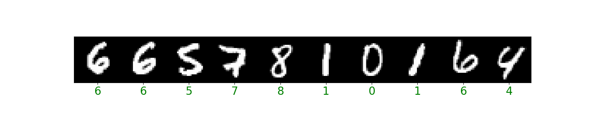

# Advanced Tensorflow

This repository shows how we can use Tensorflow 2.X advanced functionalities in order to build our custom Loss Functions, Layers, Models and even Callbacks. This is very useful to adapt any given project to its own nature given business context and organization necessities.

Each module is concerned with a different custom application:

+ Custom model, based on a VGG structure in order to bring some modularity to the code
+ Custom layer, in order to allow different approaches and constructions
+ Custom loss, which enables us to take the most of our business goal
+ Custom callback, in order to perform a given task after each epoch

In particular, we have built a visualization callback that allows us to visualize how the predictions are obtained after each epoch until the end of the training stage:

